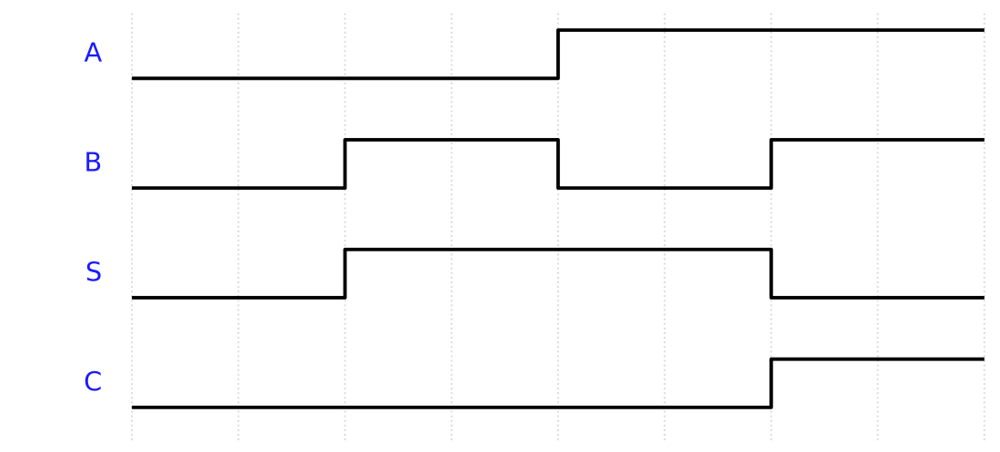
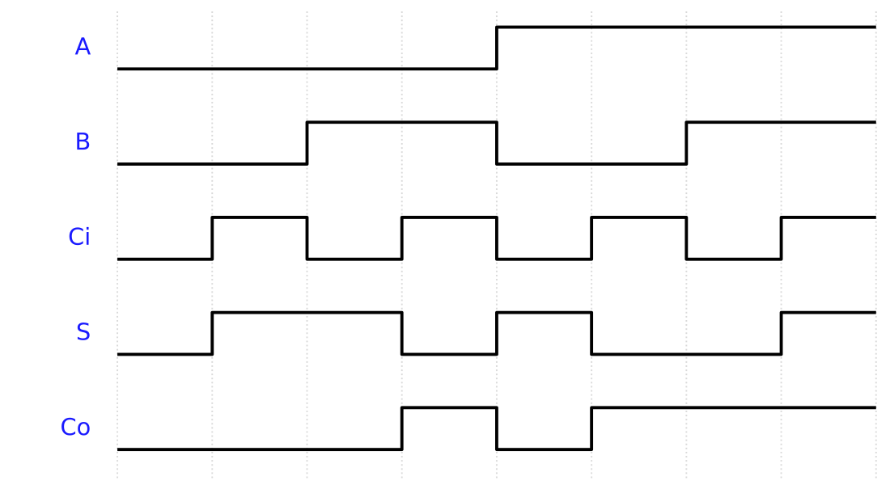

# Week 2 — Testbenches: How Do We Test the Circuit We Described?

## The historical idea

We *described* a circuit last week. Verilog's reason for existing is the next question: **how
do we test it?** A testbench is a Verilog module that creates inputs, feeds the circuit
through an **instantiation**, and lets us observe outputs in the Console and as a waveform.

## Objectives

- Structure a testbench: stimulus (`reg`), observation (`wire`), and the instantiated DUT.
- Use **named instantiation** `M0(.S(s), .C(c), .A(a), .B(b))`.
- Use `$display`, `$monitor`, `$dumpfile`/`$dumpvars`, `$finish`.
- Read `` `timescale `` and `#` delays (precision is detailed in Week 8).

## Concept (short)

A testbench has **no ports** — it is the top of the simulation. Inputs are `reg` (you drive
them); outputs are `wire` (the DUT drives them). The waveform appears only if you dump it.

| Task | Meaning |
|---|---|
| `$display(...)` | print once, now |
| `$monitor(...)` | print automatically whenever a listed signal changes |
| `$dumpfile`/`$dumpvars` | record signals for the Waveform tab |
| `$finish` | stop the simulation |

## Example 1 — Testbench for the half adder

Compact monitor format `ab:cs`, the style from the slides.

**`design.v`**
```verilog
module halfadder(output S, C, input A, B);
    xor G0 (S, A, B);
    and G1 (C, A, B);
endmodule
```

**`testbench.v`**
```verilog
`timescale 1ns/1ns
module tb;
    reg  a, b;          // reg for inputs
    wire s, c;          // wire for outputs
    halfadder M0(.S(s), .C(c), .A(a), .B(b));
    initial begin
        $dumpfile("dump.vcd"); $dumpvars(0, tb);
        $display("ab:cs");
        $monitor("%b%b:%b%b", a, b, c, s);
        a=0; b=0; #10;
        a=0; b=1; #10;
        a=1; b=0; #10;
        a=1; b=1; #10;
        $finish;
    end
endmodule
```

**Expected Console**
```
ab:cs
00:00
01:00
10:00
11:10
```

> ▶ <strong><a href="https://senolgulgonul.github.io/verisim/?design=https://raw.githubusercontent.com/senolgulgonul/verilog/main/w02_halfadder.v&amp;testbench=https://raw.githubusercontent.com/senolgulgonul/verilog/main/w02_halfadder_tb.v" target="_blank" rel="noopener">Open in VeriSim</a></strong> — loads `w02_halfadder.v` + `w02_halfadder_tb.v` and runs (Verilog-2005).



(Reading `cs`: the carry is high only for `11`.)

## Example 2 — Testbench for the full adder

Loop over all 8 input combinations with a 3-bit counter.

**`design.v`** — `fulladder` from Week 1.

**`testbench.v`**
```verilog
`timescale 1ns/1ns
module tb;
    reg  [2:0] in;             // {A, B, Ci}
    wire S, Co;
    integer i;
    fulladder M0(.S(S), .Co(Co), .A(in[2]), .B(in[1]), .Ci(in[0]));
    initial begin
        $dumpfile("dump.vcd"); $dumpvars(0, tb);
        $display("A B Ci : Co S");
        for (i = 0; i < 8; i = i + 1) begin
            in = i; #10;
            $display("%b %b  %b :  %b %b", in[2], in[1], in[0], Co, S);
        end
        $finish;
    end
endmodule
```

**Expected Console**
```
A B Ci : Co S
0 0  0 :  0 0
0 0  1 :  0 1
0 1  0 :  0 1
0 1  1 :  1 0
1 0  0 :  0 1
1 0  1 :  1 0
1 1  0 :  1 0
1 1  1 :  1 1
```

> ▶ <strong><a href="https://senolgulgonul.github.io/verisim/?design=https://raw.githubusercontent.com/senolgulgonul/verilog/main/w02_fulladder.v&amp;testbench=https://raw.githubusercontent.com/senolgulgonul/verilog/main/w02_fulladder_tb.v" target="_blank" rel="noopener">Open in VeriSim</a></strong> — loads `w02_fulladder.v` + `w02_fulladder_tb.v` and runs (Verilog-2005).



## Example 3 — Testbench for the 2-to-1 MUX

Drive data and select; watch the output follow the chosen input.

**`design.v`** — `mux2to1` from Week 1 (gate-level), or any equivalent.

**`testbench.v`**
```verilog
`timescale 1ns/1ns
module tb;
    reg  a, b, s;
    wire y;
    mux2to1 M0(.Y(y), .A(a), .B(b), .S(s));
    initial begin
        $dumpfile("dump.vcd"); $dumpvars(0, tb);
        $display("a b:s y");
        $monitor("%b %b:%b %b", a, b, s, y);
        a=0; b=1; s=0; #10;   // s=0 -> y follows a
        s=1;             #10;  // s=1 -> y follows b
        a=1; b=0; s=0;   #10;
        s=1;             #10;
        $finish;
    end
endmodule
```

> ▶ <strong><a href="https://senolgulgonul.github.io/verisim/?design=https://raw.githubusercontent.com/senolgulgonul/verilog/main/w02_mux2to1.v&amp;testbench=https://raw.githubusercontent.com/senolgulgonul/verilog/main/w02_mux2to1_tb.v" target="_blank" rel="noopener">Open in VeriSim</a></strong> — loads `w02_mux2to1.v` + `w02_mux2to1_tb.v` and runs (Verilog-2005).

## Run it in VeriSim

1. Run example 1. The Console shows the header then one line per change (that is `$monitor`).
2. Replace `$monitor` with a `$display` inside each step. Notice: `$display` prints exactly
   when called; `$monitor` prints whenever a signal changes.
3. Open the **Waveform** and confirm the carry/output behaviour visually.

## What to look for

- `reg` for inputs, `wire` for outputs — getting this backwards is the most common first error.
- The instance name (`M0`) and dotted ports are the exam-standard form.
- `$dumpvars(0, tb)` uses the testbench module name. Rename the module → update the dump call.

## Exercises (session 2)

1. **MUX from your testbench.** Write a self-driving testbench for your Week-1 `mux2to1` that
   checks all four `(a,b)` for both `s` values; format the output as `a b:sel y`.
2. **Decoder testbench.** Write a testbench for the 2-to-4 decoder that prints `Y3 Y2 Y1 Y0`
   for each address, with `G=1`, then once with `G=0`.
3. **Timing read.** Insert a `#15` somewhere and predict the exact `$time` of every following
   line before running; confirm against the Console.
4. **No `$finish`.** Remove `$finish`, run, and explain what happens and why it matters.
