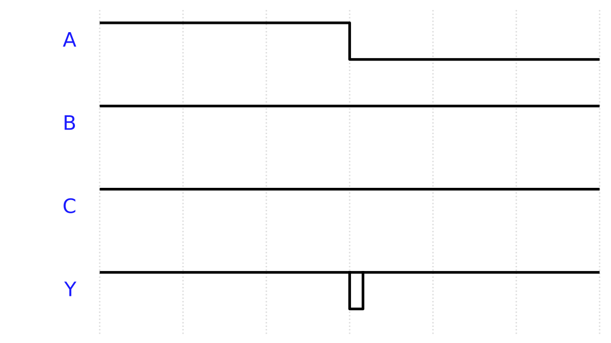

# Week 5 — Timing in Combinational Circuits: Delay & Glitches

## The historical idea

Real gates are not instantaneous. After an input changes, an output settles only after the
signal propagates through the gates — and on the way it can momentarily show a **wrong** value:
a **glitch** (hazard). Simulation lets us *see* this before it causes trouble in a clocked
circuit later.

## Objectives

- Add gate **propagation delay** with `#` on primitives.
- Distinguish rise/fall and total path delay.
- Reproduce and explain a **glitch**.
- Reason about why ripple-carry settling grows with width.

## Concept (short)

Delay goes on the primitive: `and #(3) G0 (Y, A, B);` — the output reacts 3 time units after
its inputs. A signal arriving at one gate by two paths of different delay can make the output
**glitch** before settling. Glitches matter because a clocked circuit (Part B) might sample one.

## Example 1 — Full adder with gate delays

Give each gate a delay and watch the outputs settle.

**`design.v`**
```verilog
module fulladder(output S, Co, input A, B, Ci);
    wire W1, W2, W3;
    xor #(2) G0 (W1, A, B);
    xor #(2) G1 (S,  W1, Ci);
    and #(1) G2 (W2, A, B);
    and #(1) G3 (W3, Ci, W1);
    or  #(1) G4 (Co, W2, W3);
endmodule
```

**`testbench.v`**
```verilog
`timescale 1ns/1ns
module tb;
    reg A,B,Ci; wire S,Co;
    fulladder M0(.S(S),.Co(Co),.A(A),.B(B),.Ci(Ci));
    initial begin
        $dumpfile("dump.vcd"); $dumpvars(0, tb);
        $monitor("t=%0t A=%b B=%b Ci=%b -> Co=%b S=%b", $time, A,B,Ci,Co,S);
        A=0;B=0;Ci=0; #20;
        A=1;B=1;Ci=0; #20;   // watch S, Co settle a few ns after the change
        A=1;B=1;Ci=1; #20;
        $finish;
    end
endmodule
```

On the waveform, `S` and `Co` update a few ns *after* the inputs — the propagation delay made
visible. Set all delays to `#0` and the lag disappears (and so do glitches — which is the trap).

## Example 2 — A static hazard (glitch)

Classic hazard: `Y = (A & B) | (~A & C)`. When `A` changes while `B = C = 1`, `Y` should stay
1, but the extra inverter delay on the `~A` path opens a brief dip to 0.

**`design.v`**
```verilog
module hazard(output Y, input A, B, C);
    wire W1, W2, W3;
    not #(2) G0 (W1, A);      // ~A is delayed
    and #(2) G1 (W2, A, B);
    and #(2) G2 (W3, W1, C);
    or  #(2) G3 (Y, W2, W3);
endmodule
```

**`testbench.v`**
```verilog
`timescale 1ns/1ns
module tb;
    reg A,B,C; wire Y;
    hazard M0(.Y(Y),.A(A),.B(B),.C(C));
    initial begin
        $dumpfile("dump.vcd"); $dumpvars(0, tb);
        $monitor("t=%0t A=%b B=%b C=%b -> Y=%b", $time, A,B,C,Y);
        B=1; C=1; A=1; #20;   // Y=1
        A=0;          #20;     // A falls: Y should stay 1 but glitches low
        $finish;
    end
endmodule
```

Zoom into the `A` transition on the waveform: `Y` briefly leaves 1, then recovers.



## Example 3 — Ripple-carry settling time

Use the delayed full adder inside the 4-bit adder and force the carry across all stages.

**`design.v`** — `fulladder` (delayed, example 1) + `fourbitadder` (Week 4 structure).

**`testbench.v`**
```verilog
`timescale 1ns/1ns
module tb;
    reg [3:0] A,B; reg C0; wire S0,S1,S2,S3,C4;
    fourbitadder M0(.S0(S0),.S1(S1),.S2(S2),.S3(S3),.C4(C4),
        .A0(A[0]),.A1(A[1]),.A2(A[2]),.A3(A[3]),
        .B0(B[0]),.B1(B[1]),.B2(B[2]),.B3(B[3]),.C0(C0));
    initial begin
        $dumpfile("dump.vcd"); $dumpvars(0, tb);
        A=4'b1111; B=4'b0000; C0=0; #30;
        B=4'b0001;             #30;   // forces carry to ripple 0->1->2->3
        $finish;
    end
endmodule
```

Use the waveform cursor to measure the time from the `B` change to the final `C4` — it grows
with the number of stages the carry must cross.

## Run it in VeriSim

1. Run example 1; confirm outputs lag the inputs by the gate delays.
2. Run example 2; measure the glitch width (it equals the inverter's extra delay).
3. Run example 3; measure the total ripple settling time.

## What to look for

- A **glitch** is a real, time-bounded wrong value, not a simulation artifact. Zero-delay
  simulation hides it — which is why we model delay here.
- Ripple-carry delay scales with width — the motivation for carry-lookahead adders.

## Exercises (session 2)

1. **Close the hazard.** Add the redundant consensus term `(B & C)` to `Y` and show the glitch
   disappears.
2. **Worst-case input.** For the delayed 4-bit adder, find the input pair with the longest
   settling time and justify it from the carry-chain length.
3. **Delay budget.** Set all gate delays to `#1` and re-measure the adder; explain the linear
   relationship between stage count and delay.
4. **Rise vs fall.** Give a gate different rise/fall delays `#(2,3)` and observe the asymmetry
   on the waveform.
