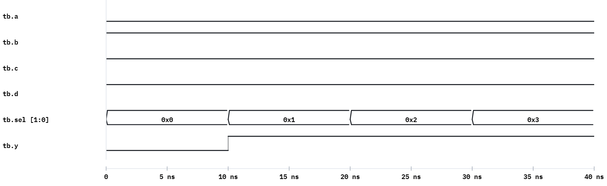

# Week 7 — Behavioral Modeling (Combinational)

## The historical idea

The highest-level combinational style: describe *what* the circuit does with procedural
statements — `if-else`, `case` — inside `always @(*)`. After this week **combinational logic is
complete** and the midterm follows.

## Objectives

- Use `always @(*)` for combinational behaviour.
- Use `if-else` and `case`.
- Use **vectors / port ranges** (`input wire [1:0] sel`, `output reg [3:0] B`).
- Read/write **binary, decimal, hex** literals (`4'd5`, `4'b0101`, `8'hA3`).
- Know why `always` outputs are `reg`, and why full assignment avoids latches.

## Concept (short)

Any signal assigned inside an `always` block must be `reg`. For **combinational** behaviour use
`always @(*)` and assign the output on **every** path (or set a default), else the tool infers
a latch. `case` is the clean multi-way form. Number literals are `<size>'<base><value>`.

## Example 1 — 2-to-1 MUX with if-else

**`design.v`**
```verilog
module mux_2to1_ifelse(
    input  wire a,    // input 0
    input  wire b,    // input 1
    input  wire sel,  // select
    output reg  y
);
    always @* begin
        if (sel) y = b;
        else     y = a;
    end
endmodule
```

## Example 2 — the same MUX with case

**`design.v`**
```verilog
module mux_2to1_case(
    input  wire a, b, sel,
    output reg  y
);
    always @* begin
        case (sel)
            1'b0:    y = a;
            1'b1:    y = b;
            default: y = a;
        endcase
    end
endmodule
```

## Example 3 — 4-to-1 MUX with a vector select (port range)

**`design.v`**
```verilog
module mux4to1(
    input  wire [1:0] sel,    // 2-bit selection
    input  wire a, b, c, d,
    output reg  y
);
    always @* begin
        case (sel)
            2'b00: y = a;
            2'b01: y = b;
            2'b10: y = c;
            2'b11: y = d;
        endcase
    end
endmodule
```

**`testbench.v`**
```verilog
`timescale 1ns/1ns
module tb;
    reg [1:0] sel; reg a,b,c,d; wire y;
    mux4to1 M0(.sel(sel), .a(a), .b(b), .c(c), .d(d), .y(y));
    initial begin
        $dumpfile("dump.vcd"); $dumpvars(0, tb);
        $monitor("Time=%0t sel=%b a=%b b=%b c=%b d=%b y=%b", $time, sel,a,b,c,d,y);
        a=0; b=1; c=1; d=1;
        sel=2'b00; #10;
        sel=2'b01; #10;
        sel=2'b10; #10;
        sel=2'b11; #10;
        $finish;
    end
endmodule
```

**Expected Console**
```
Time=0 sel=00 a=0 b=1 c=1 d=1 y=0
Time=10 sel=01 a=0 b=1 c=1 d=1 y=1
Time=20 sel=10 a=0 b=1 c=1 d=1 y=1
Time=30 sel=11 a=0 b=1 c=1 d=1 y=1
```



## Example 4 — case with number literals (exam style)

Output a chosen value depending on a 1-bit input — the `student_id_output` idea.

**`design.v`**
```verilog
module digit_select(input A, output reg [3:0] B);
    always @(*) begin
        case (A)
            1'b0:    B = 4'd5;     // e.g. last digit of an ID
            1'b1:    B = 4'd4;     // second-to-last digit
            default: B = 4'd0;
        endcase
    end
endmodule
```

The same function as a single dataflow conditional (to show equivalence):
```verilog
module digit_select_df(input A, output [3:0] B);
    assign B = (A == 0) ? 4'd5 : 4'd4;
endmodule
```

## Run it in VeriSim

1. Run examples 1 and 2; confirm `if-else` and `case` give the same MUX behaviour.
2. Run example 3 → the `Time=… y=…` table above.
3. Run example 4 both ways (`case` and conditional `assign`) and confirm identical outputs —
   *style is description, not implementation*.
4. **Latch trap:** delete the `2'b11` branch from `mux4to1` (no default) and note the missing
   assignment would infer a latch in synthesis (Week 10). Add `default:` to stay combinational.

## What to look for

- **`reg` vs `wire`:** `case`/`always` outputs are `reg`; `assign` outputs are `wire`. Mixing
  these is the most common Week-7 compile error.
- Assign the output on every path in `always @(*)` (or set a default at the top).

## Exercises (session 2)

1. **Decoder, behavioral.** 2-to-4 decoder with `case`; self-check (exactly one bit high).
2. **Number literals.** Output `8'hA3` when `A=1`, `8'b0000_1111` when `A=0`; confirm on the
   waveform.
3. **Priority encoder.** 4-input priority with `if-else if`; explain why order matters here but
   not in `mux4to1`.
4. **2-to-1 to 4-to-1.** Build a 4-to-1 MUX by nesting two `mux_2to1_case` instances and a
   selector; compare with the flat `case` version.

---

> **Midterm checkpoint.** Students can now: transcribe a circuit to primitives, write proper
> and self-checking testbenches, build hierarchy, reason about timing/glitches, and model
> combinational logic three ways (gate / dataflow / behavioral).
