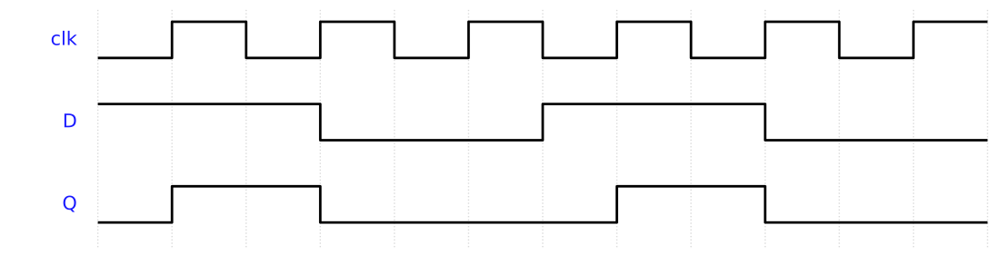

# Week 8 — Sequential Design: D Flip-Flop, Timescale & Waveforms

## The historical idea

Until now outputs depended only on current inputs (combinational). **Sequential** circuits
*remember*: they update on a clock **edge**. With clocks in play, *time* becomes central — so
`` `timescale `` and the **waveform** stop being optional and become how you read a design.

## Objectives

- Describe an edge-triggered **D flip-flop** with `always @(posedge Clk)`.
- Build a **1-bit register with enable** and a multi-bit register.
- Build a **shift register**.
- Read `` `timescale unit/precision `` and generate a clock in a testbench.

## Concept (short)

A flip-flop captures `D` on the rising edge:

```verilog
always @(posedge Clk) Q <= D;     // non-blocking <= for clocked logic (full story Week 9)
```

`` `timescale 1ns/1ps `` = **unit** 1 ns (what `#1` means), **precision** 1 ps (the rounding
grid). The midterm's `1ns/100ps` rounds delays to 100 ps. Generate a clock in the testbench:

```verilog
reg clk = 0;
always #1 clk = ~clk;   // 2 ns period
```

## Example 1 — D flip-flop (his form)

**`design.v`**
```verilog
// D flip-flop without reset
module DFF(
    output reg Q,
    input  wire D,
    input  wire Clk
);
    always @(posedge Clk) begin
        Q <= D;
    end
endmodule
```

**`testbench.v`**
```verilog
`timescale 1ns/1ps
module tb;
    reg D, Clk; wire Q;
    DFF M0(.Q(Q), .D(D), .Clk(Clk));
    initial begin Clk = 0; forever #1 Clk = ~Clk; end   // 2 ns period
    initial begin
        $dumpfile("dump.vcd"); $dumpvars(0, tb);
        $monitor("t=%0t Clk=%b D=%b Q=%b", $time, Clk, D, Q);
        D=0; #3 D=1; #4 D=0; #4 D=1; #4 $finish;
    end
endmodule
```

> ▶ **[Open in VeriSim](https://senolgulgonul.github.io/verisim/?design=https://raw.githubusercontent.com/senolgulgonul/verilog/main/w08_dff.v&testbench=https://raw.githubusercontent.com/senolgulgonul/verilog/main/w08_dff_tb.v)** — loads `w08_dff.v` + `w08_dff_tb.v` and runs (Verilog-2005).

On the waveform `Q` follows `D`, but only **at each rising edge** — `Q` is a sampled, delayed
copy of `D`.



## Example 2 — 1-bit register with write enable

> Clock cycles every 2 ns; `enable=1` writes the data; with `enable=0` the register *keeps* its
> value even if `data` changes — that "keeping" is memory.

**`design.v`**
```verilog
module reg1(
    output reg Q,
    input  wire data, enable, clk
);
    always @(posedge clk) begin
        if (enable) Q <= data;     // write only when enabled
    end
endmodule
```

**`testbench.v`**
```verilog
`timescale 1ns/1ps
module tb;
    reg data, enable, clk; wire Q;
    reg1 M0(.Q(Q), .data(data), .enable(enable), .clk(clk));
    initial begin clk = 0; forever #1 clk = ~clk; end
    initial begin
        $dumpfile("dump.vcd"); $dumpvars(0, tb);
        $monitor("t=%0t en=%b data=%b Q=%b", $time, enable, data, Q);
        enable=1; data=1; #2;     // write 1
        enable=0; data=0; #4;     // disabled: Q stays 1 though data changed
        enable=1;         #2;     // write again -> Q follows data (0)
        $finish;
    end
endmodule
```

> ▶ **[Open in VeriSim](https://senolgulgonul.github.io/verisim/?design=https://raw.githubusercontent.com/senolgulgonul/verilog/main/w08_reg1.v&testbench=https://raw.githubusercontent.com/senolgulgonul/verilog/main/w08_reg1_tb.v)** — loads `w08_reg1.v` + `w08_reg1_tb.v` and runs (Verilog-2005).

## Example 3 — N-bit register and a shift register

**`design.v`**
```verilog
module register #(parameter N = 4)
(input clk, input rst, input load, input [N-1:0] D, output reg [N-1:0] Q);
    always @(posedge clk) begin
        if (rst)       Q <= {N{1'b0}};
        else if (load) Q <= D;
    end
endmodule

module shift4(input clk, input rst, input din, output reg [3:0] Q);
    always @(posedge clk) begin
        if (rst) Q <= 4'b0;
        else     Q <= {Q[2:0], din};   // shift left; din enters at LSB
    end
endmodule
```

> ▶ **[Open in VeriSim](https://senolgulgonul.github.io/verisim/?design=https://raw.githubusercontent.com/senolgulgonul/verilog/main/w08_shift4.v&testbench=https://raw.githubusercontent.com/senolgulgonul/verilog/main/w08_shift4_tb.v)** — loads `w08_shift4.v` + `w08_shift4_tb.v` and runs (Verilog-2005).

Watch a single `1` walk through `Q` of the shift register on the waveform.

## Run it in VeriSim

1. Run example 1. Drop a cursor on a rising edge: `Q` takes the value `D` had *at* that edge,
   not between edges. That "sample on the edge" picture is the whole idea.
2. Run example 2. With `enable=0`, change `data` and confirm `Q` does **not** move.
3. Change the clock to `always #2` and watch the period change; switch the testbench to
   `` `timescale 1ns/100ps `` and add a `#0.34` delay to see the rounding grid.

## What to look for

- **Edge, not level.** `Q` updates only on `posedge`. Students from combinational logic must
  *see* this to believe it.
- **Hold = memory.** The `enable=0` interval where `Q` ignores `data` is the moment "register"
  earns its name.

## Exercises (session 2)

1. **Add reset.** Give `DFF` an asynchronous reset (`always @(posedge Clk or posedge rst)`);
   show the reset region at t≈0 on the waveform.
2. **Parameterized shift.** Make `shift4` an `N`-bit shift register with a serial-out port;
   test `N=8`.
3. **Precision experiment.** With `1ns/100ps`, apply `#0.06` and explain the rounded result.
4. **Sync vs async reset.** Implement both and compare their reset timing on the waveform.
