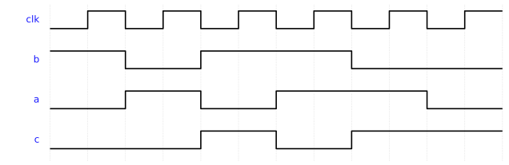

# Week 9 — Blocking vs Non-Blocking Assignments

## The historical idea

Now that we have clocks, the *kind* of assignment inside an `always` block changes the
hardware. This is the most error-prone topic in Verilog, and the waveform is the only honest
way to see the difference.

## Objectives

- Distinguish blocking `=` from non-blocking `<=`.
- Apply the rule: **clocked logic → `<=`, combinational `always @(*)` → `=`**.
- See the **one-cycle pipeline** non-blocking creates.
- Recognize the simulation/synthesis mismatch caused by the wrong choice.

## Concept (short)

- **Blocking `=`** executes immediately, in order; the next line sees the *new* value.
- **Non-blocking `<=`** samples all right-hand sides first, then updates together at the end of
  the step; every statement sees the *old* values — exactly how real flip-flops behave.

| Logic kind | Block | Assignment |
|---|---|---|
| Sequential (clocked) | `always @(posedge clk)` | `<=` |
| Combinational | `always @(*)` | `=` |

## Example 1 — Non-blocking (his example): `a <= b; c <= a;`

**`design.v`**
```verilog
`timescale 1ns/1ps
module nonblocking_example(
    input  wire clk,
    input  wire b,
    output reg  a,
    output reg  c
);
    initial begin a = 0; c = 0; end
    always @(posedge clk) begin
        a <= b;   // non-blocking
        c <= a;   // 'c' gets the OLD value of 'a' (before 'a' becomes 'b')
    end
endmodule
```

**`testbench.v`**
```verilog
`timescale 1ns/1ps
module tb;
    reg clk, b; wire a, c;
    nonblocking_example DUT(.clk(clk), .b(b), .a(a), .c(c));
    initial begin clk = 0; forever #1 clk = ~clk; end
    initial begin
        $dumpfile("dump.vcd"); $dumpvars(0, tb);
        $monitor("t=%0t b=%b a=%b c=%b", $time, b, a, c);
        b=0; #3 b=1; #6 b=0; #6 $finish;
    end
endmodule
```

**Expected Console**
```
t=0 b=0 a=0 c=0
t=3 b=1 a=1 c=0
t=5 b=1 a=1 c=1
t=9 b=0 a=0 c=1
t=11 b=0 a=0 c=0
```

`c` lags `a` by one clock — a **pipeline**. When `b` becomes 1, `a` becomes 1 on the next edge,
and only on the *following* edge does `c` (which sampled the old `a`) become 1.



## Example 2 — Blocking: `a = b; c = a;`

Same module, blocking assignment. Now `c` gets the **new** `a` in the same cycle.

**`design.v`**
```verilog
`timescale 1ns/1ps
module blocking_example(
    input  wire clk,
    input  wire b,
    output reg  a,
    output reg  c
);
    initial begin a = 0; c = 0; end
    always @(posedge clk) begin
        a = b;   // blocking - immediate update
        c = a;   // 'c' gets the NEW value of 'a'
    end
endmodule
```

Run with the same testbench (rename the instance). `a` and `c` now move **together** — the
one-cycle pipeline of example 1 is gone.

## Example 3 — The register-swap test

The cleanest demonstration of the difference.

**`design.v`**
```verilog
module swap_nb(input clk, input [3:0] init_x, init_y, input load,
               output reg [3:0] x, y);
    always @(posedge clk) begin
        if (load) begin x <= init_x; y <= init_y; end
        else      begin x <= y;      y <= x;      end   // non-blocking: real swap
    end
endmodule
// Replace <= with = and x,y both become the same value (no swap).
```

## Run it in VeriSim

1. Run example 1, open the **Waveform**, stack `b`, `a`, `c`. The one-cycle offset between `a`
   and `c` *is* the lesson — point at it.
2. Run example 2 and watch the offset disappear.
3. Run example 3 with `<=` (correct swap), then change to `=` and watch the swap break.

## What to look for

- Non-blocking models "all flip-flops sample old values at the edge"; blocking models an
  immediate sequential update — correct for combinational `always @(*)`, wrong for registers.
- The swap (`x<=y; y<=x;`) works with `<=` but not `=`. This single example settles the rule.

## Exercises (session 2)

1. **Predict then verify.** Before running, predict the `a`/`c` waveforms for both example 1
   and example 2; then confirm.
2. **Three-stage pipeline.** Extend the non-blocking example to `a<=b; c<=a; d<=c;` and count
   the cycles until `d` is stable.
3. **Mixed mistake.** In one clocked block, mix one `=` and one `<=` on dependent signals and
   explain the surprising result from the waveform.
