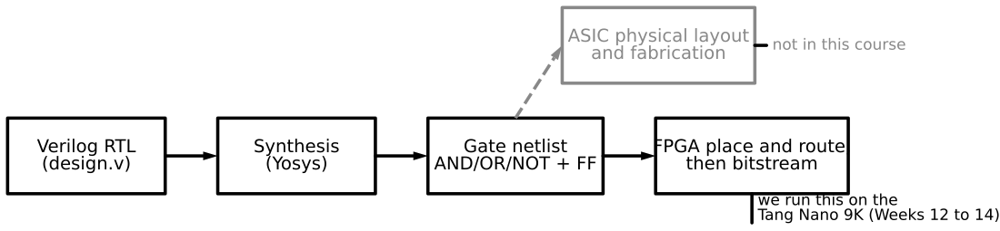
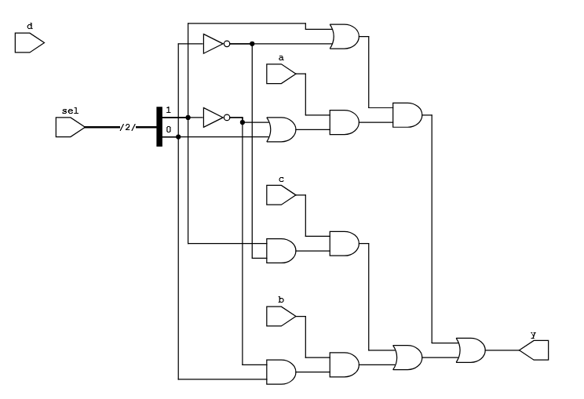
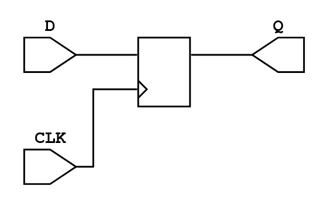

# Week 10 — Synthesis: From Describing to Designing

## The historical idea (the turning point)

So far Verilog has done what it was *invented* to do: **describe** a hand-designed circuit and
**test** it. The historical leap that made Verilog dominate: if a tool can read your
description, it can also **build** the circuit. That is **synthesis** — Verilog → a gate-level
**netlist**. In this course we follow the result **up to the synthesized schematic**; physical
design (floorplanning, place & route, layout, fabrication) is mentioned but not performed.

## Objectives

- State what synthesis does: source → gate/RTL netlist.
- Use VeriSim's **Synthesize** to view **Gates** and **RTL** schematics.
- Read the difference: **RTL** keeps your hierarchy; **Gates** shows AND/OR/NOT.
- Identify **what is synthesizable** vs simulation-only.

## Concept (short)

A synthesizer (VeriSim uses **Yosys**) converts RTL into primitive cells. The result *may
differ from what you expected* but is logically equivalent. Two views:

- **Gates** — function in AND/OR/NOT only; matches the SOP/Karnaugh form, so an `xor` appears
  decomposed.
- **RTL** — higher view that keeps modules and shows registers/adders/muxes as blocks.



A concrete **Gates** view — the behavioral 4-to-1 mux from Week 7 (a `case` on `sel`) after
synthesis: `sel` drives inverters, each data input `a`/`b`/`c`/`d` passes through an AND gate
enabled by the decoded select lines, and an OR gate combines them into `y`. The `case` you wrote
is now pure AND/OR/NOT — logically identical, just lowered to primitives.



## Synthesizable vs simulation-only

| Synthesizable (becomes hardware) | Simulation-only |
|---|---|
| `assign`, `always @(*)`, `always @(posedge clk)` | `initial` blocks (use a reset instead) |
| `if-else`, `case`, operators, vectors | `#` delays (ignored by synthesis) |
| module instantiation, parameters | `$display`, `$monitor`, `$dumpfile`, `$finish`, `$random` |

Rule of thumb: describes *circuit structure/behaviour* → synthesizes; *controls the simulation*
→ does not. Incomplete `always @(*)` assignment → inferred **latch**.

## Example 1 — See the full adder synthesized

Use the gate-level `fulladder` (or the dataflow one) from earlier weeks.

**`design.v`** — `fulladder` (Week 1).

Press **Synthesize → Gates**: the function in primitive gates. Press **RTL**: the higher-level
view. Since the design is already gate-level, the two look similar — a good first, simple case.

## Example 2 — Hierarchy preserved: the 4-bit adder

**`design.v`** — `fulladder` + `fourbitadder` (Week 4).

**Synthesize → RTL**: four `fulladder` blocks in a carry chain — *your* hierarchy, preserved.
**Gates**: the same function flattened into AND/OR/NOT. Same circuit, two zoom levels — this
answers "where did my modules go?"

## Example 3 — A flip-flop synthesizes; an initial block does not

**`design.v`**
```verilog
// D flip-flop without reset
`timescale 1ns/1ps
module DFF(output reg Q, input D, CLK);
    always @(posedge CLK) Q <= D;     // synthesizes to ONE flip-flop
endmodule
```

**Synthesize → RTL** shows a single D flip-flop cell. Add a stray `initial Q = 0;` and note it
is a power-up value on an FPGA, not logic — it creates no gate.



## Example 4 — The latch trap (and the fix)

**`design.v`**
```verilog
module bad_mux(input [1:0] sel, input a, b, c, d, output reg y);
    always @(*)
        case (sel)
            2'b00: y = a;
            2'b01: y = b;
            2'b10: y = c;
            // 2'b11 missing, no default -> y must "remember" -> LATCH
        endcase
endmodule
```

> ▶ **[Open in VeriSim](https://senolgulgonul.github.io/verisim/?design=https://raw.githubusercontent.com/senolgulgonul/verilog/main/w10_bad_mux.v&testbench=https://raw.githubusercontent.com/senolgulgonul/verilog/main/w10_bad_mux_tb.v)** — loads `w10_bad_mux.v` + `w10_bad_mux_tb.v` and runs (Verilog-2005).

Synthesize and read the latch warning. Add `default: y = a;` and the latch disappears.

## Run it in VeriSim

1. Synthesize examples 1 and 2; toggle **RTL** ↔ **Gates** and describe, in one sentence each,
   what changed (hierarchy kept vs dissolved).
2. Synthesize example 3; find the single flip-flop in the RTL view.
3. Synthesize example 4; observe the latch, then fix it with `default`.

## What to look for

- **RTL vs Gates**: RTL keeps modules; Gates is the technology-independent primitive form.
- The **latch** from an incomplete `case` is the most common synthesizable-code bug — catch it
  in the browser, not on the board.
- Beyond the schematic comes physical design (place & route, layout) — the path to silicon
  (e.g. TinyTapeout). We stop at the schematic; the FPGA weeks map a synthesized design onto a
  real device.

## Exercises (session 2)

1. **Style equivalence.** Synthesize the half adder written three ways (gate, dataflow,
   behavioral); confirm the Gates view is the same function each time.
2. **Count the flip-flops.** Synthesize a 4-bit counter and count flip-flops in the RTL view;
   relate to the bit width.
3. **Synthesizable audit.** Take a module containing `#delay` and `$display` and rewrite it as
   synthesizable; list what you removed and why.
4. **Multiplier surprise.** Synthesize `assign p = a * b;` for 4-bit `a,b` and inspect how much
   logic a single `*` produces.
