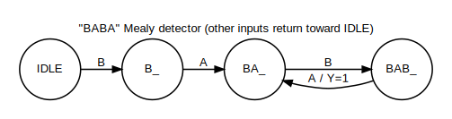
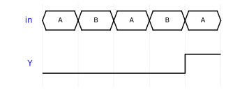

# Week 11 — Finite State Machines: Mealy, Moore, Pattern Detection

## The historical idea

Sequential building blocks (Weeks 8–9) plus combinational next-state logic (Weeks 6–7) combine
into the most useful sequential abstraction: the **finite state machine** — a state register
plus logic for the **next state** and the **output**. Pattern detection is the classic example.

## Objectives

- Build an FSM as **state register + next-state logic + output logic**.
- Distinguish **Moore** (output = f(state)) from **Mealy** (output = f(state, input)).
- Implement the **"BABA" detector** (his example, inputs A/B/C/D as buttons).
- Verify exactly *when* the output fires, on the Console and waveform.

## Concept (short)

An FSM has a finite set of states; **transitions** move between them on inputs; **outputs** are
generated from the current state (**Moore**) or from state + input (**Mealy**). Mealy reacts in
the same cycle as the input but can glitch; Moore is stable but lags by a cycle.

## Example 1 — "BABA" detector (Mealy) — his example

> Inputs A, B, C, D are four buttons (one-hot). Detect the sequence **B → A → B → A**. Output
> `Y=1` the moment the fourth symbol completes. It is a **Mealy** machine because `Y` depends
> on being in state `BAB_` **and** seeing input `A`.



**`design.v`**
```verilog
module sequence_detector(
    input clk, input rst,
    input A, input B, input C, input D,
    output reg Y
);
    localparam IDLE=2'd0, B_=2'd1, BA_=2'd2, BAB_=2'd3;
    reg [1:0] state, next;

    // state register (clocked)
    always @(posedge clk or posedge rst)
        if (rst) state <= IDLE;
        else     state <= next;

    // next-state + Mealy output (combinational)
    always @(*) begin
        next = state;
        Y = 1'b0;
        case (state)
            IDLE: if (B) next = B_;                       // got B
            B_:   if (A) next = BA_; else if (B) next = B_; else next = IDLE;
            BA_:  if (B) next = BAB_; else next = IDLE;    // got B A B
            BAB_: if (A) begin Y = 1'b1; next = BA_; end   // B A B A  -> detect! (overlap)
                  else if (B) next = B_; else next = IDLE;
        endcase
    end
endmodule
```

**`testbench.v`**
```verilog
`timescale 1ns/1ns
module tb;
    reg clk=0, rst=1, A=0, B=0, C=0, D=0; wire Y;
    sequence_detector M0(.clk(clk),.rst(rst),.A(A),.B(B),.C(C),.D(D),.Y(Y));
    always #5 clk = ~clk;
    // Mealy: apply input, observe Y (combinational), THEN clock to register the transition
    task feed(input pa,pb,pc,pd);
        begin
            @(posedge clk);
            A=pa; B=pb; C=pc; D=pd;
            #1 $display("A=%b B=%b C=%b D=%b -> Y=%b", A,B,C,D, Y);
        end
    endtask
    initial begin
        $dumpfile("dump.vcd"); $dumpvars(0, tb);
        @(negedge clk) rst = 0;
        feed(1,0,0,0); // A  (ignored from IDLE)
        feed(0,1,0,0); // B
        feed(1,0,0,0); // A
        feed(0,1,0,0); // B
        feed(1,0,0,0); // A  -> BABA complete -> Y=1
        feed(0,0,1,0); // C
        feed(0,0,0,1); // D
        @(posedge clk) $finish;
    end
endmodule
```

**Expected Console**
```
A=1 B=0 C=0 D=0 -> Y=0
A=0 B=1 C=0 D=0 -> Y=0
A=1 B=0 C=0 D=0 -> Y=0
A=0 B=1 C=0 D=0 -> Y=0
A=1 B=0 C=0 D=0 -> Y=1
A=0 B=0 C=1 D=0 -> Y=0
A=0 B=0 C=0 D=1 -> Y=0
```

`Y=1` appears exactly on the fifth input — the `A` that completes `B-A-B-A` (the leading `A` is
ignored from `IDLE`).



> **Why observe `Y` before the clock edge?** A Mealy output is combinational. The `feed` task
> applies the input, waits `#1` for logic to settle, prints `Y`, and *then* the next edge
> registers the state change. Sampling after the edge would miss the pulse.

## Example 2 — Moore version of a detector (for comparison)

A Moore "1011" overlapping detector: the output depends only on state, so it is glitch-free and
lags by one cycle.

**`design.v`**
```verilog
module moore1011(input clk, input rst, input din, output detected);
    localparam S0=3'd0,S1=3'd1,S2=3'd2,S3=3'd3,S4=3'd4;
    reg [2:0] state;
    always @(posedge clk or posedge rst)
        if (rst) state <= S0;
        else case (state)
            S0: state <= din ? S1 : S0;
            S1: state <= din ? S1 : S2;
            S2: state <= din ? S3 : S0;
            S3: state <= din ? S4 : S2;
            S4: state <= din ? S1 : S2;
        endcase
    assign detected = (state == S4);   // Moore: from state only
endmodule
```

Feed `1011011` (bit0 first) and detection fires at bit#3 and the overlapping bit#6.

## Example 3 — Toward hardware (preview of Week 13)

On the board, the BABA detector's inputs map to buttons and `Y` to an LED, driven by a slow
clock so symbols can be pressed by hand. The FSM source is unchanged from simulation. We build
this in Week 13; note now which signals become buttons (`A,B,C,D`) and which an LED (`Y`).

## Run it in VeriSim

1. Run example 1; confirm `Y=1` on the fifth input.
2. **Synthesize → RTL**: a small state register feeding combinational next-state/output logic —
   the textbook FSM block diagram from your code.
3. Run example 2 and compare *when* it fires (Moore lags) versus the Mealy version.

## What to look for

- **Mealy vs Moore timing.** Mealy `Y` pulses in the same cycle as the triggering input; Moore
  `detected` reflects the state and is stable for a full cycle. The waveform shows both.
- **Overlap.** Both detectors reuse a trailing symbol to start the next match.

## Exercises (session 2)

1. **Trace by hand.** For the BABA detector, write the state after each input of `B A B A B A`
   and mark every `Y=1`; verify against simulation.
2. **Non-overlapping.** Modify BABA so a detection resets fully to `IDLE` (no overlap). Show the
   difference on a stream containing `BABABA`.
3. **Moore BABA.** Re-cast the BABA detector as a Moore machine (add a "detected" state) and
   compare the firing cycle with the Mealy version.
