# Week 12 — FPGA & the Tang Nano 9K: The Third Use of Verilog

## The historical idea — three uses of Verilog

1. **Describe & simulate** a hand-designed circuit (Weeks 1–9, 11).
2. **Synthesize** — let the tool build the circuit (Week 10).
3. **FPGA implementation** — load that circuit onto reconfigurable silicon (now).

An **FPGA** is *field-programmable*: instead of fixed gates it has **Configurable Logic Blocks**
of **Look-Up Tables**. A 4-input LUT is a 16×1 memory — program its cells and it computes *any*
4-input function. Your synthesized netlist becomes a LUT/flip-flop configuration (the
**bitstream**).

## Objectives

- Explain CLB / LUT.
- Identify the Tang Nano 9K peripherals: LEDs, buttons, clock.
- Set up a Gowin project for **GW1NR-9C** (`GW1NR-UV9QN88PC6/I5`) and write a `.cst` file.
- Run the flow: synthesize → floor planner → place & route → programmer → schematic viewer.

## The board (one per student)

| Resource | Pin(s) | Polarity |
|---|---|---|
| Clock (27 MHz) | 52 | — |
| LEDs (6) | 10, 11, 13, 14, 15, 16 | **active-LOW** (lit when pin = 0) |
| Button S1 | 4 | active-LOW (pressed = 0) |
| Button S2 | 3 | active-LOW (pressed = 0) |

> LEDs are common-anode from the supply, so drive a pin **low** to light it. Keep logic
> positive and invert once at the pins. Gowin EDA is **free, no license**.

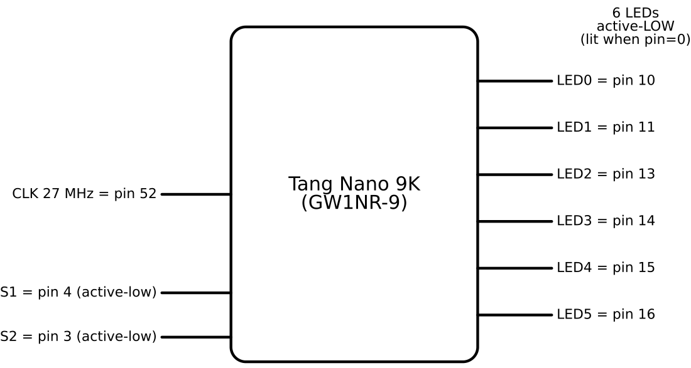

The board itself (one per student). **Front** — USB-C, the two buttons **S1** and **S2**, and
the GW1NR FPGA (marked "TANG NANO 9K / SiPEED"):

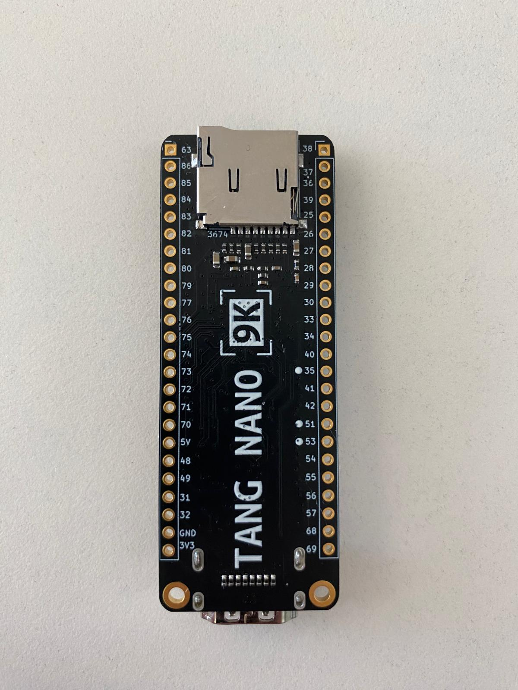

**Back** — the pin-number silkscreen down both header rows. These are exactly the numbers you
put in the `.cst` constraints file (e.g. LEDs 10/11/13/14/15/16, clock 52):

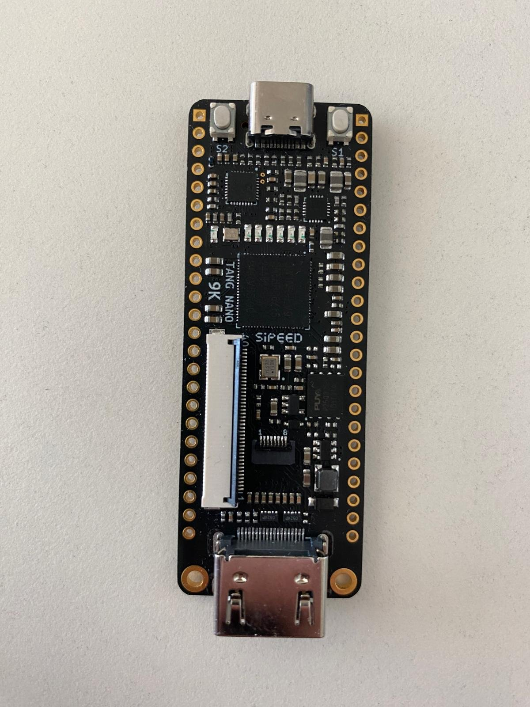

A board running a design, with the on-board LEDs lit:

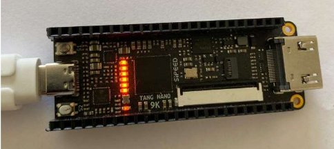

## The Gowin IDE flow (slides 197–206)

The full flow on a tiny `buffer` (`assign out = in;`) project, end to end.

**1. New Project → FPGA Design Project**, then name it in the Project Wizard.

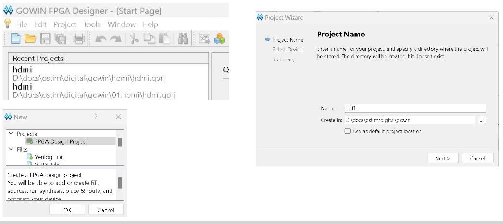

**2. Select Device → Summary.** This board is series **GW1NR**, part
`GW1NR-UV9QN88PC6/I5`, device **GW1NR-9C**, package **QFN88P**, speed **C6/I5**. Confirm on
the Summary page (match it to your board's silkscreen).

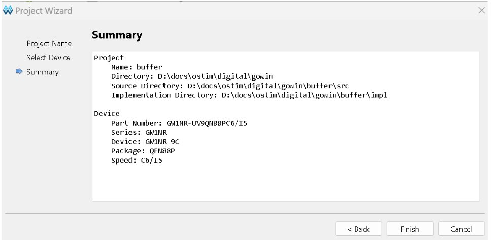

**3. Add a Verilog file** (here `buffer.v` with the `simple_assign` module). A `.cst`
constraints file is added later (step 6).

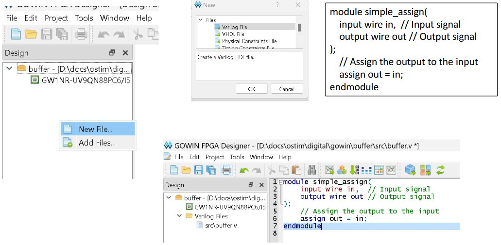

**4. Process panel → Synthesize.** Right-click *Synthesize → Run*. *Configuration* exposes
options such as Dual-Purpose Pins (e.g. "Use DONE as regular IO").

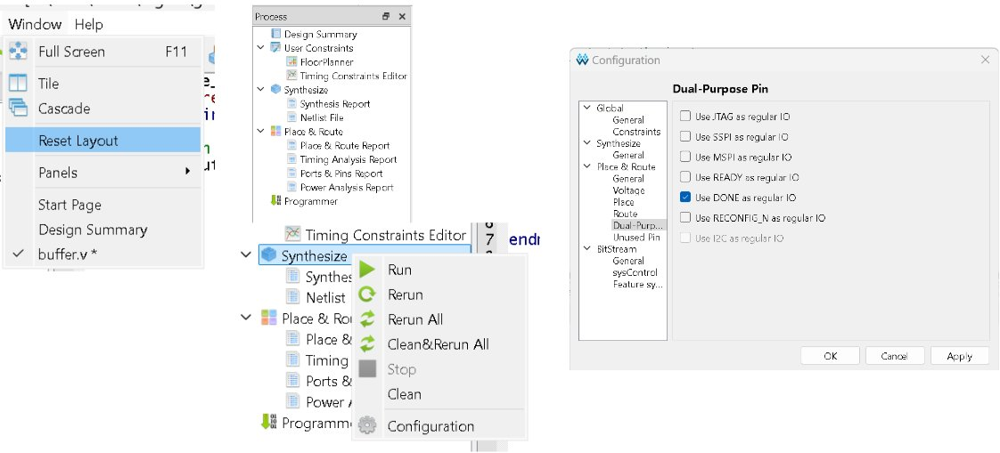

**5. Synthesis finishes** (green check; console shows `GowinSynthesis finish`). If there is no
`.cst` yet, Gowin offers to create a default one.

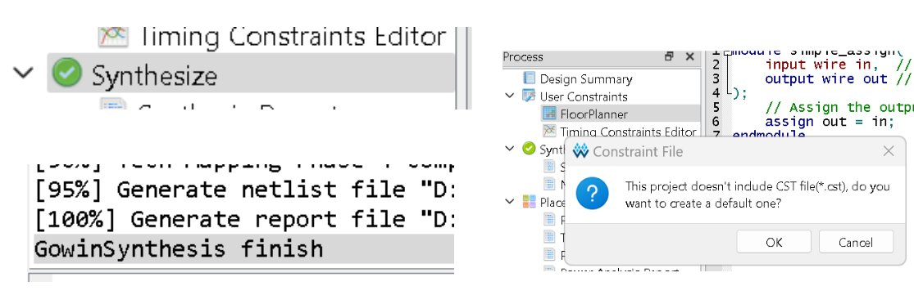

**6. Floor Planner → I/O Constraints.** Assign ports to physical pins. For `buffer`, `in` →
pin **3** (button S2) and `out` → pin **10** (LED0). This writes the `.cst`.

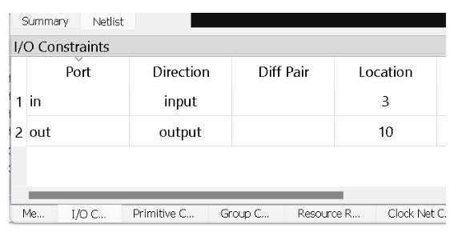

**7. Place & Route** → generates the bitstream (a `.tr.html` timing report is produced).

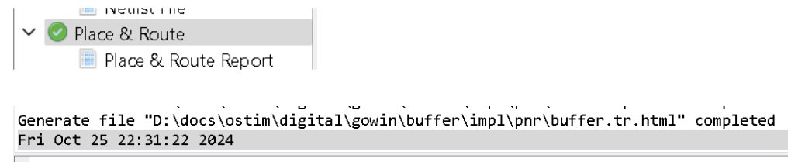

**8. Programmer** → pick the USB Debugger cable; write to **SRAM** (fast, volatile) or **Flash**
(persistent). The log ends with `Program Finished!` and the board lights up.

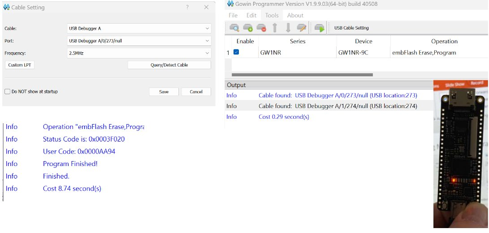

**9. Schematic Viewer** (Tools → Schematic Viewer → **RTL Design Viewer** / **Post-Synthesis
Netlist Viewer**) — the on-board analogue of VeriSim's RTL view. For `buffer` it is a single
buffer from `in` to `out`.

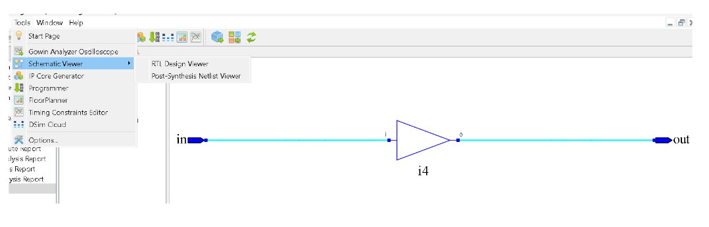

The Schematic Viewer also shows gate-level designs. Here an `and_gate_primitive`
(`and u1 (out, a, b);`) appears as a single AND gate `u1` — the same primitive you wrote in
Week 1, now realized on the device:

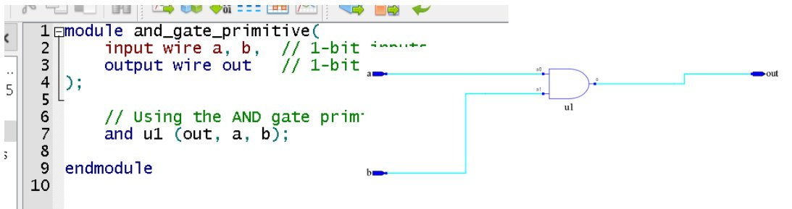

## Example 1 — AND gate to an LED (his example)

Two buttons in, one LED out — derived through the active-low hardware.

**`design.v`**
```verilog
module and_demo(input s1, input s2, output led);
    // buttons pressed = 0; LED lit = 0.
    // "light when BOTH pressed": both pressed = (~s1 & ~s2); lit means output 0 -> invert.
    assign led = ~(~s1 & ~s2);     // simplifies to (s1 | s2)
endmodule
```

**`testbench.v`**
```verilog
`timescale 1ns/1ns
module tb;
  reg s1, s2;
  wire led;
  and_demo dut(.s1(s1), .s2(s2), .led(led));
  initial begin
    $dumpfile("dump.vcd"); $dumpvars(0, tb);
    $display("s1 s2 | led (0 = lit)");
    s1=1; s2=1; #1 $display(" %b  %b |  %b", s1, s2, led);
    s1=1; s2=0; #1 $display(" %b  %b |  %b", s1, s2, led);
    s1=0; s2=1; #1 $display(" %b  %b |  %b", s1, s2, led);
    s1=0; s2=0; #1 $display(" %b  %b |  %b", s1, s2, led);
    $finish;
  end
endmodule
```

Expected (Icarus): `led=0` only when both buttons are pressed (`s1=s2=0`).

**`and_demo.cst`**
```
IO_LOC  "s1"  4;  IO_PORT "s1"  PULL_MODE=UP;
IO_LOC  "s2"  3;  IO_PORT "s2"  PULL_MODE=UP;
IO_LOC  "led" 10; IO_PORT "led" PULL_MODE=UP DRIVE=8;
```

> ▶ **[Open in VeriSim](https://senolgulgonul.github.io/verisim/?design=https://raw.githubusercontent.com/senolgulgonul/verilog/main/w12_and_demo.v&testbench=https://raw.githubusercontent.com/senolgulgonul/verilog/main/w12_and_demo_tb.v)** — loads `w12_and_demo.v` + `w12_and_demo_tb.v` and runs (Verilog-2005).

## Example 2 — Half adder on the board

Reuse your verified `halfadder`: two buttons → two LEDs (sum and carry).

**`design.v`**
```verilog
module half_adder_board(input s1, input s2, output [1:0] led);
    wire a = ~s1, b = ~s2;          // active-low buttons -> positive logic
    wire sum   = a ^ b;
    wire carry = a & b;
    assign led = ~{carry, sum};     // active-low LEDs
endmodule
```

**`testbench.v`**
```verilog
`timescale 1ns/1ns
module tb;
  reg s1, s2;
  wire [1:0] led;
  half_adder_board dut(.s1(s1), .s2(s2), .led(led));
  initial begin
    $dumpfile("dump.vcd"); $dumpvars(0, tb);
    $display("s1 s2 | led = ~(carry,sum)");
    s1=1; s2=1; #1 $display(" %b  %b |  %b", s1, s2, led);
    s1=1; s2=0; #1 $display(" %b  %b |  %b", s1, s2, led);
    s1=0; s2=1; #1 $display(" %b  %b |  %b", s1, s2, led);
    s1=0; s2=0; #1 $display(" %b  %b |  %b", s1, s2, led);
    $finish;
  end
endmodule
```

Expected (Icarus): `11, 10, 10, 01` — both pressed gives carry (`led=01`).

**`half_adder_board.cst`**
```
IO_LOC  "s1"     4;  IO_PORT "s1" PULL_MODE=UP;
IO_LOC  "s2"     3;  IO_PORT "s2" PULL_MODE=UP;
IO_LOC  "led[0]" 10; IO_PORT "led[0]" PULL_MODE=UP DRIVE=8;
IO_LOC  "led[1]" 11; IO_PORT "led[1]" PULL_MODE=UP DRIVE=8;
```

> ▶ **[Open in VeriSim](https://senolgulgonul.github.io/verisim/?design=https://raw.githubusercontent.com/senolgulgonul/verilog/main/w12_half_adder_board.v&testbench=https://raw.githubusercontent.com/senolgulgonul/verilog/main/w12_half_adder_board_tb.v)** — loads `w12_half_adder_board.v` + `w12_half_adder_board_tb.v` and runs (Verilog-2005).

## Example 3 — if-else pattern selector

Press a button to switch between two LED patterns.

**`design.v`**
```verilog
module ifelse_demo(input s1, output [5:0] leds);
    reg [5:0] pattern;
    always @(*) begin
        if (s1 == 1'b0) pattern = 6'b101010;   // S1 pressed
        else            pattern = 6'b010101;
    end
    assign leds = ~pattern;                     // invert once, at the pin boundary
endmodule
```

**`testbench.v`**
```verilog
`timescale 1ns/1ns
module tb;
  reg s1;
  wire [5:0] leds;
  ifelse_demo dut(.s1(s1), .leds(leds));
  initial begin
    $dumpfile("dump.vcd"); $dumpvars(0, tb);
    s1=1; #1 $display("s1=%b leds=%b", s1, leds);
    s1=0; #1 $display("s1=%b leds=%b", s1, leds);
    $finish;
  end
endmodule
```

> ▶ **[Open in VeriSim](https://senolgulgonul.github.io/verisim/?design=https://raw.githubusercontent.com/senolgulgonul/verilog/main/w12_ifelse_demo.v&testbench=https://raw.githubusercontent.com/senolgulgonul/verilog/main/w12_ifelse_demo_tb.v)** — loads `w12_ifelse_demo.v` + `w12_ifelse_demo_tb.v` and runs (Verilog-2005).

Expected (Icarus): `s1=1 -> 101010`, `s1=0 -> 010101` (depends on `s1` only).

(Constraints: `s1` on 4; `leds[0..5]` on 10/11/13/14/15/16 — see the reference file.)

## Verify in VeriSim, then build

1. In VeriSim, test each design over the relevant button combinations (reading LEDs as
   inverted: `led=0` means lit).
2. In Gowin: New Project → GW1NR-9C → add `design.v` + `.cst` → Synthesize → Place & Route →
   Program (SRAM to test).
3. Press buttons; confirm the LED behaviour matches simulation after inversion.

## What to look for

- **Same source, two destinations.** The design file is identical between VeriSim and Gowin.
- **Active-low is not a bug.** Derive `~(~s1 & ~s2)` rather than memorizing it.
- Compare Gowin's **Schematic Viewer** with VeriSim's **RTL** view of the same module.

## Exercises (session 2)

1. **OR / XOR on the LED.** Re-derive the constraint-correct expression for "lit when *either*
   pressed" and "exclusive-or"; program and confirm.
2. **Three LEDs at once.** Show `s1`, `s2`, and `s1 ^ s2` on LEDs 10/11/13.
3. **Decoder on board.** Put the Week-7 behavioral 2-to-4 decoder on four LEDs, driven by the
   two buttons.
4. **SRAM vs Flash.** Program to SRAM, power-cycle (gone); to Flash, power-cycle (persists).
   Explain in one sentence.
