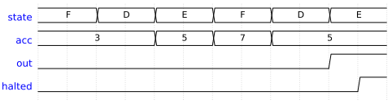

# Week 14 — Microcontroller Architecture: Build a Tiny CPU

## The historical idea

The course ends where digital design becomes *programmable*. A CPU is just a well-organized FSM
(Week 11) wired to memory (Week 13) and an ALU (Week 6). We use **AVR** as the reference
(students met it via Arduino), then build a minimal **4-bit MCU** that runs a tiny program
through **fetch → decode → execute**. RISC-V is introduced only briefly.

## Objectives

- Explain **von Neumann vs Harvard** and what an **instruction** is.
- Describe **fetch → decode → execute** as a three-state FSM.
- Build a 4-bit accumulator MCU: ROM, ALU, registers, output.
- Run `LDA 3, LDB 2, ADD, ADD, SUB, STS` → **5** (3+2+2−2).
- Know what RISC-V is and why we stop here.

## Concept (short)

- **von Neumann:** one memory for program + data. **Harvard:** separate memories (AVR is
  Harvard). The **program counter (PC)** holds the address of the next instruction.
- An **instruction** is a coded operation. Ours is 8 bits: `[7:4]` opcode, `[3:0]` immediate.
- The control unit is an FSM cycling **FETCH** (read instruction at PC) → **DECODE** (advance
  PC) → **EXECUTE** (do the operation).

| Opcode | Mnemonic | Action |
|---|---|---|
| 1 | `LDA imm` | ACC ← imm |
| 2 | `LDB imm` | B ← imm |
| 3 | `ADD` | ACC ← ACC + B |
| 4 | `SUB` | ACC ← ACC − B |
| 5 | `STS` | OUT ← ACC |
| F | `HLT` | stop |

## Example 1 — building blocks you already have

Before the full CPU, note each piece is a circuit from earlier weeks:

```verilog
// ALU (Week 6 dataflow): ADD/SUB on 4-bit operands
module alu4(input [3:0] a, b, input op, output [3:0] r);
    assign r = op ? (a - b) : (a + b);   // op=0 add, op=1 sub
endmodule

// a register (Week 8): loads on a clock edge
module reg4(input clk, input load, input [3:0] d, output reg [3:0] q);
    always @(posedge clk) if (load) q <= d;
endmodule
```

## Example 2 — the whole 4-bit MCU

Verified in Icarus: produces OUT = 5, then halts.

**`design.v`**
```verilog
module mcu4(input clk, input rst, output reg [3:0] out, output reg halted);
    localparam LDA=4'h1, LDB=4'h2, ADD=4'h3, SUB=4'h4, STS=4'h5, HLT=4'hF;
    localparam FETCH=2'd0, DECODE=2'd1, EXEC=2'd2;

    reg [7:0] rom [0:7];      // program memory
    reg [2:0] pc;             // program counter
    reg [7:0] ir;             // instruction register
    reg [3:0] acc, b;         // accumulator + B register
    reg [1:0] state;

    initial begin             // program: 3 + 2 + 2 - 2 = 5
        rom[0] = {LDA, 4'd3}; // ACC = 3
        rom[1] = {LDB, 4'd2}; // B   = 2
        rom[2] = {ADD, 4'd0}; // ACC = 5
        rom[3] = {ADD, 4'd0}; // ACC = 7
        rom[4] = {SUB, 4'd0}; // ACC = 5
        rom[5] = {STS, 4'd0}; // OUT = 5
        rom[6] = {HLT, 4'd0};
        rom[7] = {HLT, 4'd0};
    end

    always @(posedge clk or posedge rst) begin
        if (rst) begin
            pc<=0; acc<=0; b<=0; out<=0; halted<=0; ir<=0; state<=FETCH;
        end else case (state)
            FETCH:  begin ir <= rom[pc]; state <= DECODE; end
            DECODE: begin pc <= pc + 1'b1; state <= EXEC; end
            EXEC: begin
                case (ir[7:4])
                    LDA: acc <= ir[3:0];
                    LDB: b   <= ir[3:0];
                    ADD: acc <= acc + b;
                    SUB: acc <= acc - b;
                    STS: out <= acc;
                    HLT: halted <= 1'b1;
                endcase
                state <= (ir[7:4]==HLT) ? EXEC : FETCH;
            end
        endcase
    end
endmodule
```

**`testbench.v`**
```verilog
`timescale 1ns/1ps
module tb;
    reg clk = 0, rst = 1; wire [3:0] out; wire halted;
    mcu4 M0(.clk(clk), .rst(rst), .out(out), .halted(halted));
    always #5 clk = ~clk;
    initial begin
        $dumpfile("dump.vcd"); $dumpvars(0, tb);
        @(negedge clk) rst = 0;
        wait (halted == 1);
        @(posedge clk);
        $display("Program finished. OUT = %0d (expected 5), halted = %b", out, halted);
        if (out == 4'd5) $display("MCU TEST PASSED"); else $display("MCU TEST FAILED");
        $finish;
    end
endmodule
```

**Expected Console**
```
Program finished. OUT = 5 (expected 5), halted = 1
MCU TEST PASSED
```


## Example 3 — on the board

Drive `mcu4` from a divided clock, route `out[3:0]` to four LEDs (active-low), add a button
reset. After the program runs the LEDs show `0101` (= 5).

```verilog
module mcu_board(input clk, input rst_btn, output [5:0] leds);
    localparam TICK = 5_000_000;
    reg [31:0] div = 0; reg slow = 0;
    always @(posedge clk) if (div==TICK) begin div<=0; slow<=~slow; end else div<=div+1;
    wire [3:0] out; wire halted;
    mcu4 cpu(.clk(slow), .rst(~rst_btn), .out(out), .halted(halted));
    assign leds = ~{2'b00, out};   // active-low
endmodule
```

## Run it in VeriSim

1. Run example 2 → **MCU TEST PASSED** (OUT = 5).
2. On the **Waveform**, add `pc`, `state`, `acc`, `b`, `out`. Watch the three-state cycle and
   `acc` move 3 → 5 → 7 → 5.
3. **Synthesize → RTL**: identify the ROM, the PC register, the ALU adder, and the state
   register — the CPU as the blocks you already know.

## A note on RISC-V

**RISC-V** is an open-standard instruction set architecture — anyone may implement it without a
license, which is why it matters industrially. A real core needs 32-bit instructions, a register
file, and a much larger decoder than our toy. We stop at awareness: our MCU shows *the
principle* (fetch/decode/execute over an ISA); RISC-V is the same idea at production scale and a
natural follow-on or project.

## Exercises (session 2)

1. **Extend the ISA.** Add `AND`, `OR`, and `JMP imm` (set PC). Write a looping program with a
   `HLT`.
2. **Wider data.** Promote the datapath to 8 bits; run a program that would overflow 4 bits to
   show why width matters.
3. **Project seed.** Implement a small program (e.g. a running sum on LEDs) end-to-end:
   simulate in VeriSim, then run on the Tang Nano 9K.

---

## Course wrap-up

In fourteen weeks students followed Verilog's own history: **describe** a circuit and **test**
it, then learn to **synthesize** it, then **implement** it on an FPGA — ending with a small CPU
running a program on real silicon. Every step was verified in VeriSim first.
