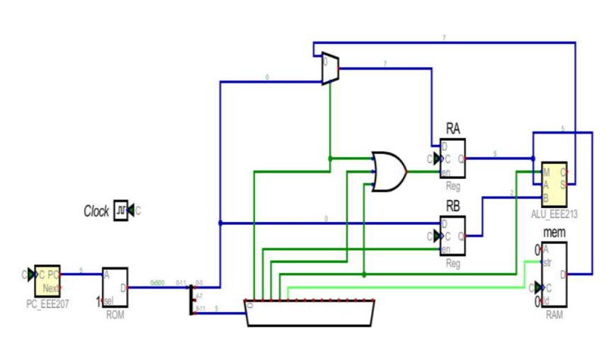
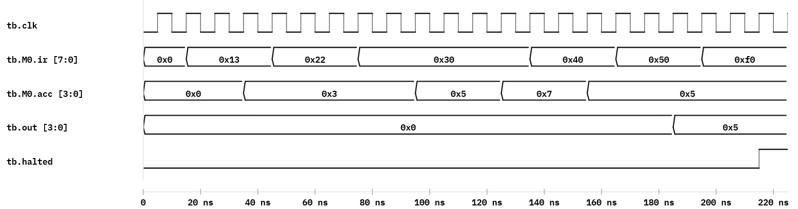
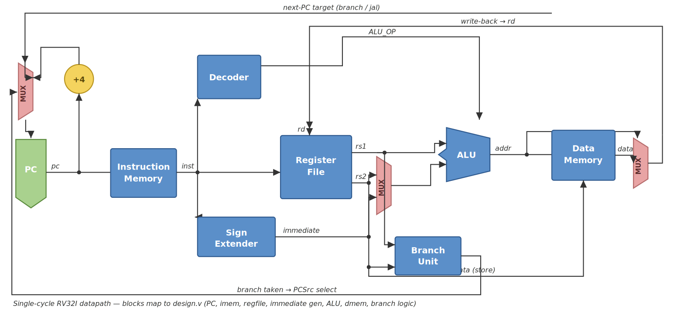
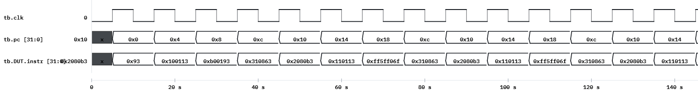

# Week 14 — Microcontroller Architecture: Build a Tiny CPU

## The historical idea

The course ends where digital design becomes *programmable*. A CPU is just a well-organized FSM
(Week 11) wired to memory (Week 13) and an ALU (Week 6). We use **AVR** as the reference
(students met it via Arduino), then build a minimal **4-bit MCU** that runs a tiny program
through **fetch → decode → execute**, see the *same* program run on a real AVR, and finish with
a working single-cycle **RISC-V (RV32I)** core.

## Objectives

- Explain **von Neumann vs Harvard** and what an **instruction** is.
- Describe **fetch → decode → execute** as a three-state FSM.
- Build a 4-bit accumulator MCU: ROM, ALU, registers, output.
- Run `LDA 3, LDB 2, ADD, ADD, SUB, STS` → **5** (3+2+2−2).
- Run the same program on a real **AVR**, then on a single-cycle **RISC-V (RV32I)** core.

## Concept (short)

- **von Neumann:** one memory for program + data. **Harvard:** separate memories (AVR is
  Harvard). The **program counter (PC)** holds the address of the next instruction.
- An **instruction** is a coded operation. Ours is 8 bits: `[7:4]` opcode, `[3:0]` immediate.
- The control unit is an FSM cycling **FETCH** (read instruction at PC) → **DECODE** (advance
  PC) → **EXECUTE** (do the operation).

| Opcode | Mnemonic | Action |
|---|---|---|
| 1 | `LDA imm` | ACC ← imm |
| 2 | `LDB imm` | B ← imm |
| 3 | `ADD` | ACC ← ACC + B |
| 4 | `SUB` | ACC ← ACC − B |
| 5 | `STS` | OUT ← ACC |
| F | `HLT` | stop |

## Example 1 — building blocks you already have

Before the full CPU, note each piece is a circuit from earlier weeks:

```verilog
// ALU (Week 6 dataflow): ADD/SUB on 4-bit operands
module alu4(input [3:0] a, b, input op, output [3:0] r);
    assign r = op ? (a - b) : (a + b);   // op=0 add, op=1 sub
endmodule

// a register (Week 8): loads on a clock edge
module reg4(input clk, input load, input [3:0] d, output reg [3:0] q);
    always @(posedge clk) if (load) q <= d;
endmodule
```

## Example 2 — the whole 4-bit MCU

Verified in Icarus: produces OUT = 5, then halts. Here is the same machine drawn as a schematic,
built in **Digital** (Helmut Neemann): the ROM and program counter feed the instruction bus, the
two registers hold `ACC` and `B`, the ALU does add/sub, and the result is latched to the output
and RAM — every block one you built in earlier weeks.



**`design.v`**
```verilog
module mcu4(input clk, input rst, output reg [3:0] out, output reg halted);
    localparam LDA=4'h1, LDB=4'h2, ADD=4'h3, SUB=4'h4, STS=4'h5, HLT=4'hF;
    localparam FETCH=2'd0, DECODE=2'd1, EXEC=2'd2;

    reg [7:0] rom [0:7];      // program memory
    reg [2:0] pc;             // program counter
    reg [7:0] ir;             // instruction register
    reg [3:0] acc, b;         // accumulator + B register
    reg [1:0] state;

    initial begin             // program bytes in HEX — these are exactly the values you see
        rom[0] = 8'h13;       // LDA 3 : ACC = 3        (opcode 1, immediate 3)
        rom[1] = 8'h22;       // LDB 2 : B   = 2        (opcode 2, immediate 2)
        rom[2] = 8'h30;       // ADD   : ACC = 3 + 2 = 5
        rom[3] = 8'h30;       // ADD   : ACC = 5 + 2 = 7
        rom[4] = 8'h40;       // SUB   : ACC = 7 - 2 = 5
        rom[5] = 8'h50;       // STS   : OUT = 5
        rom[6] = 8'hF0;       // HLT
        rom[7] = 8'hF0;       // HLT
    end

    always @(posedge clk or posedge rst) begin
        if (rst) begin
            pc<=0; acc<=0; b<=0; out<=0; halted<=0; ir<=0; state<=FETCH;
        end else case (state)
            FETCH:  begin ir <= rom[pc]; state <= DECODE; end
            DECODE: begin pc <= pc + 1'b1; state <= EXEC; end
            EXEC: begin
                case (ir[7:4])
                    LDA: acc <= ir[3:0];
                    LDB: b   <= ir[3:0];
                    ADD: acc <= acc + b;
                    SUB: acc <= acc - b;
                    STS: out <= acc;
                    HLT: halted <= 1'b1;
                endcase
                state <= (ir[7:4]==HLT) ? EXEC : FETCH;
            end
        endcase
    end
endmodule
```

Each byte is **opcode (high nibble) + immediate (low nibble)**, so `0x13` decodes as opcode `1`
(`LDA`) with immediate `3`, and `0xF0` is opcode `F` (`HLT`). These are exactly the hex values
that step across `ir` in the waveform below — handy for tracing the program by eye.

**`testbench.v`**
```verilog
`timescale 1ns/1ps
module tb;
    reg clk = 0, rst = 1; wire [3:0] out; wire halted;
    mcu4 M0(.clk(clk), .rst(rst), .out(out), .halted(halted));
    always #5 clk = ~clk;
    initial begin
        $dumpfile("dump.vcd"); $dumpvars(0, tb);
        @(negedge clk) rst = 0;
        wait (halted == 1);
        @(posedge clk);
        $display("Program finished. OUT = %0d (expected 5), halted = %b", out, halted);
        if (out == 4'd5) $display("MCU TEST PASSED"); else $display("MCU TEST FAILED");
        $finish;
    end
endmodule
```

**Expected Console**
```
Program finished. OUT = 5 (expected 5), halted = 1
MCU TEST PASSED
```

> ▶ **[Open in VeriSim](https://senolgulgonul.github.io/verisim/?design=https://raw.githubusercontent.com/senolgulgonul/verilog/main/w14_mcu4.v&testbench=https://raw.githubusercontent.com/senolgulgonul/verilog/main/w14_mcu4_tb.v)** — loads `w14_mcu4.v` + `w14_mcu4_tb.v` and runs (Verilog-2005).


## Example 3 — on the board

Drive `mcu4` from a divided clock, route `out[3:0]` to four LEDs (active-low), add a button
reset. After the program runs the LEDs show `0101` (= 5).

```verilog
module mcu_board(input clk, input rst_btn, output [5:0] leds);
    localparam TICK = 5_000_000;
    reg [31:0] div = 0; reg slow = 0;
    always @(posedge clk) if (div==TICK) begin div<=0; slow<=~slow; end else div<=div+1;
    wire [3:0] out; wire halted;
    mcu4 cpu(.clk(slow), .rst(~rst_btn), .out(out), .halted(halted));
    assign leds = ~{2'b00, out};   // active-low
endmodule
```

## Run it in VeriSim

1. Run example 2 → **MCU TEST PASSED** (OUT = 5).
2. On the **Waveform**, add `pc`, `state`, `acc`, `b`, `out`. Watch the three-state cycle and
   `acc` move 3 → 5 → 7 → 5.
3. **Synthesize → RTL**: identify the ROM, the PC register, the ALU adder, and the state
   register — the CPU as the blocks you already know.

## The same program on a real AVR

The toy MCU is not a cartoon. The **AVR** chip on an Arduino Uno or Nano runs the *same kind* of
program — `fetch → decode → execute` over its own ISA — and you can write that assembly by hand
from inside an ordinary sketch, then read the answer back over the serial monitor.

Here is our 4-bit MCU program — `LDA 3, LDB 2, ADD, ADD, SUB, STS` → **5** (3 + 2 + 2 − 2) —
rewritten as **AVR inline assembly**. The mnemonics line up almost one-to-one with our toy
opcodes (`LDA`/`LDB` → `ldi`, `ADD` → `add`, `SUB` → `sub`, `STS` → `sts`):

```cpp
// Arduino sketch — the 4-bit MCU program on a real AVR (Uno / Nano)
// Senol Gulgonul
volatile byte a = 0;

void setup() {
  Serial.begin(9600);
  asm volatile (
    "ldi r26, 3      \n"   // LDA 3 : ACC = 3
    "ldi r27, 2      \n"   // LDB 2 : B   = 2
    "add r26, r27    \n"   // ADD   : ACC = 3 + 2 = 5
    "add r26, r27    \n"   // ADD   : ACC = 5 + 2 = 7
    "sub r26, r27    \n"   // SUB   : ACC = 7 - 2 = 5
    "sts a, r26      \n"   // STS   : a = ACC = 5
    : : : "r26", "r27"      // tell the compiler these registers were used
  );
  Serial.print("a = ");
  Serial.println(a);        // Serial Monitor prints:  a = 5
}

void loop() { }
```

Flash it, open the **Serial Monitor at 9600 baud**, and you see `a = 5` — the exact result your
4-bit `mcu4` produced in VeriSim. Same idea, real silicon.

## RISC-V

Our 4-bit MCU shows the *principle*. **RISC-V** is that same principle at industrial scale: an
**open-standard instruction set architecture (ISA)** that anyone may implement free of license
fees — which is why it now appears in microcontrollers, phones, and datacenter chips. The
specifications are published openly at [riscv.org](https://riscv.org/), with the full ISA manuals
under [riscv.org/technical/specifications](https://riscv.org/technical/specifications/).

The base 32-bit integer ISA, **RV32I**, keeps the same `fetch → decode → execute` loop you just
built, but with 32-bit instructions, **32 general-purpose registers** (`x0`–`x31`, where `x0` is
hardwired to 0), and a wider decoder that recognises arithmetic, branch, jump, and load/store
formats. The diagram below is a **single-cycle** RV32I datapath — one instruction per clock —
which is exactly what the `design.v` further down implements:



Just like the `rom[]` in our 4-bit MCU, we embed the program directly as machine code — so this
real (subset) RV32I core runs in VeriSim with **no toolchain**. It computes
`sum = 1 + 2 + … + 10 = 55` with a genuine loop (`addi`, `add`, `beq`, `jal`) and stores the
result to data memory.

**`design.v`**

```verilog
// Single-cycle RV32I (subset). The program is embedded inline (no $readmemh,
// no firmware), so it runs in VeriSim with no toolchain. Pair with testbench.v.

// register file: 32 x 32-bit, x0 hardwired to 0
module regfile(
    input             clk,
    input      [4:0]  rs1, rs2, rd,
    input             we,
    input      [31:0] wd,
    output     [31:0] rd1, rd2
);
    reg [31:0] r [0:31];
    integer k;
    initial for (k = 0; k < 32; k = k + 1) r[k] = 32'b0;
    assign rd1 = (rs1 == 5'd0) ? 32'b0 : r[rs1];
    assign rd2 = (rs2 == 5'd0) ? 32'b0 : r[rs2];
    always @(posedge clk)
        if (we && rd != 5'd0) r[rd] <= wd;
endmodule

// CPU core
module cpu(
    input             clk,
    input             rst,
    output reg [31:0] pc,
    output     [31:0] dmem0       // expose data memory word 0 for checking
);
    // instruction memory (word addressed)
    reg [31:0] imem [0:63];
    integer i;
    initial begin
        for (i = 0; i < 64; i = i + 1) imem[i] = 32'h00000013; // NOP
        imem[0] = 32'h00000093;   // addi x1, x0, 0     ; sum = 0
        imem[1] = 32'h00100113;   // addi x2, x0, 1     ; i = 1
        imem[2] = 32'h00b00193;   // addi x3, x0, 11    ; limit = 11
        imem[3] = 32'h00310863;   // beq  x2, x3, done
        imem[4] = 32'h002080b3;   // add  x1, x1, x2    ; sum += i
        imem[5] = 32'h00110113;   // addi x2, x2, 1     ; i++
        imem[6] = 32'hff5ff06f;   // jal  x0, loop
        imem[7] = 32'h00102023;   // sw   x1, 0(x0)     ; done: store sum
        imem[8] = 32'h0000006f;   // jal  x0, 0         ; halt (self loop)
    end

    // data memory
    reg [31:0] dmem [0:63];
    initial for (i = 0; i < 64; i = i + 1) dmem[i] = 32'b0;
    assign dmem0 = dmem[0];

    // fetch
    wire [31:0] instr = imem[pc[31:2]];

    // decode fields
    wire [6:0] opcode = instr[6:0];
    wire [4:0] rd     = instr[11:7];
    wire [2:0] f3     = instr[14:12];
    wire [4:0] rs1    = instr[19:15];
    wire [4:0] rs2    = instr[24:20];
    wire [6:0] f7     = instr[31:25];

    // immediates
    wire [31:0] immI = {{20{instr[31]}}, instr[31:20]};
    wire [31:0] immS = {{20{instr[31]}}, instr[31:25], instr[11:7]};
    wire [31:0] immB = {{19{instr[31]}}, instr[31], instr[7],
                        instr[30:25], instr[11:8], 1'b0};
    wire [31:0] immU = {instr[31:12], 12'b0};
    wire [31:0] immJ = {{11{instr[31]}}, instr[31], instr[19:12],
                        instr[20], instr[30:21], 1'b0};

    // register file
    wire [31:0] rdata1, rdata2;
    reg         regwrite;
    reg  [31:0] wdata;
    regfile RF(.clk(clk), .rs1(rs1), .rs2(rs2), .rd(rd),
               .we(regwrite), .wd(wdata), .rd1(rdata1), .rd2(rdata2));

    // ALU
    reg  [31:0] alu;
    always @(*) begin
        case (opcode)
            7'b0010011: begin                  // I-type ALU
                case (f3)
                    3'b000: alu = rdata1 + immI;                       // addi
                    3'b111: alu = rdata1 & immI;                       // andi
                    3'b110: alu = rdata1 | immI;                       // ori
                    3'b100: alu = rdata1 ^ immI;                       // xori
                    3'b001: alu = rdata1 << immI[4:0];                 // slli
                    3'b101: alu = rdata1 >> immI[4:0];                 // srli
                    3'b010: alu = ($signed(rdata1) < $signed(immI)) ? 32'd1 : 32'd0; // slti
                    3'b011: alu = (rdata1 < immI) ? 32'd1 : 32'd0;     // sltiu
                    default: alu = 32'b0;
                endcase
            end
            7'b0110011: begin                  // R-type
                case (f3)
                    3'b000: alu = (f7[5]) ? (rdata1 - rdata2) : (rdata1 + rdata2); // sub/add
                    3'b111: alu = rdata1 & rdata2;                     // and
                    3'b110: alu = rdata1 | rdata2;                     // or
                    3'b100: alu = rdata1 ^ rdata2;                     // xor
                    3'b001: alu = rdata1 << rdata2[4:0];               // sll
                    3'b101: alu = rdata1 >> rdata2[4:0];               // srl
                    3'b010: alu = ($signed(rdata1) < $signed(rdata2)) ? 32'd1 : 32'd0; // slt
                    3'b011: alu = (rdata1 < rdata2) ? 32'd1 : 32'd0;   // sltu
                    default: alu = 32'b0;
                endcase
            end
            7'b0110111: alu = immU;             // lui
            7'b0000011: alu = rdata1 + immI;    // lw  (address)
            7'b0100011: alu = rdata1 + immS;    // sw  (address)
            default:    alu = 32'b0;
        endcase
    end

    // branch decision
    reg branch_taken;
    always @(*) begin
        branch_taken = 1'b0;
        if (opcode == 7'b1100011)
            case (f3)
                3'b000: branch_taken = (rdata1 == rdata2);                  // beq
                3'b001: branch_taken = (rdata1 != rdata2);                  // bne
                3'b100: branch_taken = ($signed(rdata1) < $signed(rdata2)); // blt
                default: branch_taken = 1'b0;
            endcase
    end

    // write-back source select
    always @(*) begin
        regwrite = 1'b0;
        wdata    = 32'b0;
        case (opcode)
            7'b0010011, 7'b0110011, 7'b0110111: begin regwrite = 1'b1; wdata = alu;            end // ALU / lui
            7'b0000011:                         begin regwrite = 1'b1; wdata = dmem[alu[31:2]]; end // lw
            7'b1101111:                         begin regwrite = 1'b1; wdata = pc + 32'd4;      end // jal
            default: ;
        endcase
    end

    // next PC + sequential state
    always @(posedge clk) begin
        if (rst) pc <= 32'b0;
        else begin
            if (opcode == 7'b0100011) dmem[alu[31:2]] <= rdata2;   // sw
            if      (opcode == 7'b1101111) pc <= pc + immJ;        // jal
            else if (branch_taken)         pc <= pc + immB;        // taken branch
            else                           pc <= pc + 32'd4;
        end
    end
endmodule
```


**`testbench.v`**
```verilog
`timescale 1ns/1ps
module tb;
    reg clk = 0, rst = 1;
    wire [31:0] pc, dmem0;
    cpu M0(.clk(clk), .rst(rst), .pc(pc), .dmem0(dmem0));
    always #5 clk = ~clk;
    integer cyc;
    initial begin
        $dumpfile("dump.vcd"); $dumpvars(0, tb);
        rst = 1; #12 rst = 0;                       // hold reset across first edge
        for (cyc=0; cyc<60; cyc=cyc+1) @(posedge clk);  // run the program
        $display("Program finished. dmem[0] = %0d (expected 55)", dmem0);
        if (dmem0 === 32'd55) $display("RISC-V TEST PASSED");
        else                  $display("RISC-V TEST FAILED");
        $finish;
    end
endmodule
```

**Expected Console**
```
Program finished. dmem[0] = 55 (expected 55)
RISC-V TEST PASSED
```

> ▶ **[Open in VeriSim](https://senolgulgonul.github.io/verisim/?design=https://raw.githubusercontent.com/senolgulgonul/verilog/main/w14_cpu.v&testbench=https://raw.githubusercontent.com/senolgulgonul/verilog/main/w14_cpu_tb.v)** — loads `w14_cpu.v` + `w14_cpu_tb.v` and runs (Verilog-2005).



The waveform shows the loop body running: `pc` walks `0xc → 0x10 → 0x14 → 0x18` and jumps back to
`0xc` ten times while `instr` cycles through the encoded words, leaving **55** in data memory at
the end.

This is where the course points next. The same three steps you have used all term — **describe,
simulate, synthesize** — scale directly from a 4-bit toy to a production ISA. RV32I makes a
natural capstone: extend the core with more `lw`/`sw` exercises, add instructions from the
[RISC-V specifications](https://riscv.org/technical/specifications/), or target the Tang Nano 9K.

(Subset implemented: `LUI, ADDI, ADD, SUB, AND, OR, XOR, SLL, SRL, SLT, SLTU, BEQ, BNE, BLT, JAL,
LW, SW`. Single-cycle for clarity; pipelining and CSR/privilege come later.)

## Exercises (session 2)

1. **Extend the ISA.** Add `AND`, `OR`, and `JMP imm` (set PC). Write a looping program with a
   `HLT`.
2. **Wider data.** Promote the datapath to 8 bits; run a program that would overflow 4 bits to
   show why width matters.
3. **Project seed.** Implement a small program (e.g. a running sum on LEDs) end-to-end:
   simulate in VeriSim, then run on the Tang Nano 9K.

---

## Course wrap-up

In fourteen weeks students followed Verilog's own history: **describe** a circuit and **test**
it, then learn to **synthesize** it, then **implement** it on an FPGA — ending with a small CPU
running a program on real silicon. Every step was verified in VeriSim first.
